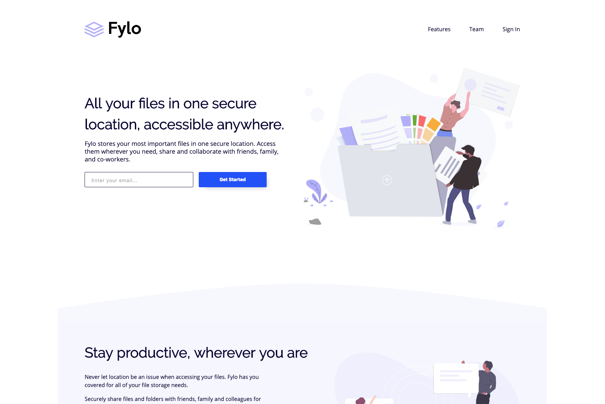

<h1 align="center"></h1>

# Fylo Company Landing Page

## Introduction

This is the landing page for a fictitious company, Fylo. Please enjoying poking around this fully responsive, styled page.

## Screenshot

## Getting Started

- Fork or directly clone this repository to your local machine
- Open `index.html` in your browser of choice
- Enjoy!

## Built With

- [React](https://reactjs.org/)
- [LESS CSS](http://lesscss.org/)

## Project Management

- Check out the [Trello Board](https://trello.com/b/xKXl8EZg/fylo-landing-page) for this project to see what was completed along the way

## Author

- [Nathan Thomas](https://github.com/nwthomas)

## Acknowledgements

- Thank you to [Front-End Mentor](https://www.frontendmentor.io/) for giving out high quality design files for projects like this.
